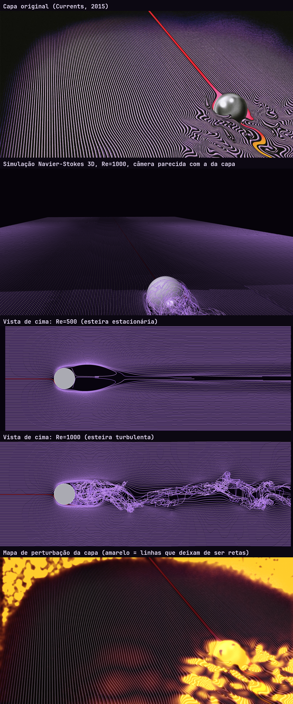

# Currents contra Navier-Stokes

A capa do álbum *Currents* (Tame Impala, 2015) mostra uma esfera metálica sobre linhas roxas paralelas que se ondulam atrás dela. Este projeto simula em 3D um fluido passando por uma esfera e solta linhas de corante como as da capa, pra ver se o desenho obedece as equações de Navier-Stokes.

**Página com resultados, imagens e animações:** https://peterhbj.github.io/currents-navier-strokes/



## Veredito

A ideia da capa é fisicamente certa, mas o desenho exagera.

- **Acerta:** se o fluido vem do fundo da imagem, as linhas ficam retas na frente da bola e tudo se perturba atrás. A linha vermelha se comporta como um filete de corante que bate no ponto de estagnação e é puxado pra esteira.
- **Erra:** a esteira da capa tem ≥ 3 diâmetros de largura logo atrás da bola. Na simulação, a parte turbulenta fica em ~1,2–1,4 D. E a turbulência real é 3D, com linhas que se cruzam, enquanto os meandros da capa são suaves e comportados.

## Validação do solver

| Grandeza | Simulação | Literatura |
|---|---|---|
| C<sub>d</sub>, Re = 100 | 1,21 | ≈ 1,09 |
| C<sub>d</sub>, Re = 500 | 0,572 | ≈ 0,55–0,57 |
| C<sub>d</sub>, Re = 1000 | 0,55 | ≈ 0,47–0,50 |
| Strouhal, Re = 1000 | 0,13 | ≈ 0,13–0,20 |

## Como rodar

Precisa de `gcc` com OpenMP, Python 3 com `numpy`, `scipy` e `Pillow`, e `ffmpeg` pras animações.

```sh
gcc -O3 -march=native -fopenmp -ffast-math -fno-finite-math-only -o lbm src/lbm.c -lm
mkdir -p re1000
# NX NY NZ D Re U passos inicio_corante snapshot_a_cada pasta [Cs]
OMP_NUM_THREADS=8 ./lbm 448 160 128 32 1000 0.1 13001 6000 50 re1000 0.06
python3 src/render.py re1000 --anim
```

A rodada acima leva ~21 min num i7 de 4 núcleos (~95 milhões de células por segundo) e usa ~1,5 GB de RAM.

- `src/lbm.c`: lattice Boltzmann D3Q19, BGK + LES Smagorinsky, esfera com bounce-back, linhas de corante advectadas com RK2
- `src/render.py`: vista de cima, vista em perspectiva, vorticidade, Cd e Strouhal
- `src/wake.py`: largura da região perturbada em função da distância
- `src/cover_analysis.py`: mapa de onde as linhas da capa deixam de ser retas (espera `cover.jpg` na pasta atual)

A capa do álbum é de Robert Beatty / Tame Impala e aparece aqui só para comparação e comentário.
